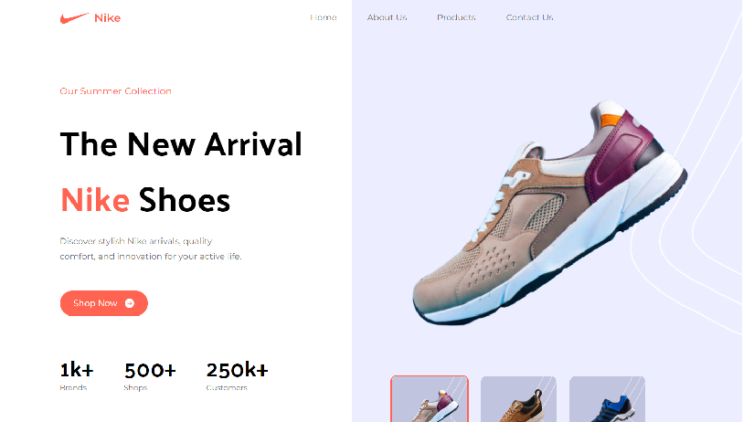

# Nike Trainer Store Clone
This is a Nike trainer store clone built using React Vite and styled using Tailwind CSS. The site features navbar, hero section, star products, customer reviews, newsletter signup and interactive footer sections.


## Features

- React Vite
- Reusable components
- TailwindCSS styling
- Tailwind themes
- Mobile responsive


## Demo


## Installation

Install nationality-predictor with npm

```bash
  cd Tailwind_CSS_store_project
  npm install
  npm start
```
    
## Screenshots




## Tech Stack

**Client:** React Vite, HTML, JavaScript, TailwindCSS


## License

[MIT](https://choosealicense.com/licenses/mit/)


## 🔗 Links
[](https://www.linkedin.com/in/thomas-turner-university-of-leeds-crystallisation/)


## Acknowledgements

 - See the excellent JavaScript Mastery for full tutorial for this project
 - https://www.youtube.com/watch?v=tS7upsfuxmo
 - https://github.com/adrianhajdin
 

 


## Authors

- [Tom Turner](https://www.github.com/tdt13)

